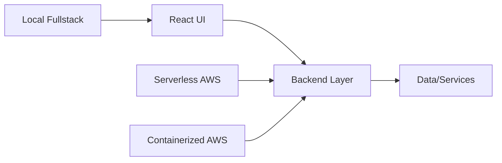

# React Labs

A focused set of React implementation references that compare architecture, deployment, and full-stack integration patterns.

This repository acts as a decision guide for building React applications across local full-stack development, serverless backends, and containerized cloud platforms.

It is designed to help you evaluate tradeoffs in developer experience, scalability, release workflows, and operational complexity.

## Core Idea

Instead of treating all React projects the same, these labs focus on:

> How React apps evolve across local full-stack builds, serverless backends, and container-based cloud deployments.

## Goals

- Provide a single map of React implementation styles used in this workspace.
- Highlight practical tradeoffs between speed of iteration and production readiness.
- Make side-by-side comparison easier when choosing a stack for new projects.

## Architecture

## Projects

### 1. React + Vite + Spring Boot
**Repository:** [react-vite-springboot](https://github.com/bganguly/react-vite-springboot)

- Fast local frontend iteration with Vite
- Spring Boot backend integration
- End-to-end full-stack workflow

### 2. React + TypeScript + Serverless AWS
**Repository:** [react-typescript-serverless-aws](https://github.com/bganguly/react-typescript-serverless-aws)

- React TypeScript frontend
- Serverless backend deployment model
- Cloud-oriented architecture

### 3. React + Spring Boot + AWS Fargate
**Repository:** [react-springboot-aws-fargate](https://github.com/bganguly/react-springboot-aws-fargate)

- Containerized backend deployment
- React frontend with AWS delivery path
- Infrastructure-aware full-stack setup

## How to Use

Each project has its own README and setup instructions.

Recommended flow:

1. Pick one architecture style
2. Run locally and review behavior
3. Compare build/deploy/runtime tradeoffs
4. Document learnings and repeat with next project

## Why This Matters

React projects often differ more by deployment model and integration strategy than by UI code alone.

This lab helps compare practical full-stack patterns in a single workspace.

## Scope

- This repository is an index and notes hub for React architecture labs.
- Source code for the listed projects lives in their own project folders.
