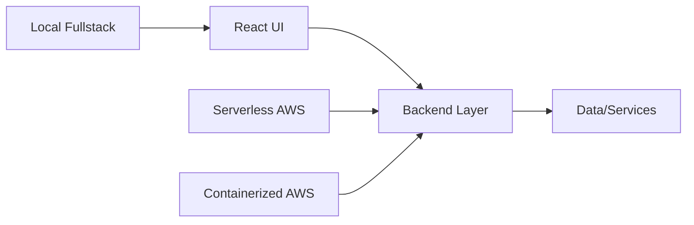

# React Labs

A collection of focused React projects demonstrating different deployment and architecture patterns.

This group connects frontend implementation choices (Vite, TypeScript, integration styles) with backend and cloud delivery models.

## Core Idea

Instead of treating all React projects the same, these labs focus on:

> How React apps evolve across local full-stack builds, serverless backends, and container-based cloud deployments.

## Architecture

## Projects

### 1. React + Vite + Spring Boot
**Workspace project:** [react-vite-springboot](../../react-vite-springboot)

- Fast local frontend iteration with Vite
- Spring Boot backend integration
- End-to-end full-stack workflow

### 2. React + TypeScript + Serverless AWS
**Workspace project:** [react-typescript-serverless-aws](../../react-typescript-serverless-aws)

- React TypeScript frontend
- Serverless backend deployment model
- Cloud-oriented architecture

### 3. React + Spring Boot + AWS Fargate
**Workspace project:** [react-springboot-aws-fargate](../../react-springboot-aws-fargate)

- Containerized backend deployment
- React frontend with AWS delivery path
- Infrastructure-aware full-stack setup

## How to Use

Each project has its own README and setup instructions.

Recommended flow:

1. Pick one architecture style
2. Run locally and review behavior
3. Compare build/deploy/runtime tradeoffs
4. Document learnings and repeat with next project

## Why This Matters

React projects often differ more by deployment model and integration strategy than by UI code alone.

This lab helps compare practical full-stack patterns in a single workspace.

## Scope

- This repository is an index and notes hub for React architecture labs.
- Source code for the listed projects lives in their own project folders.
